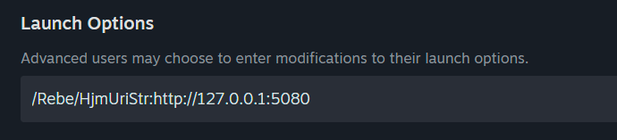

# Player quick start

The host runs the shared backend. You run the Avalonia relay on your own
computer and point it at the host through ZeroTier.

Download the relay package from the [ReVerse v0.2.0 release](https://github.com/lannahirave/reverse-fanmade/releases/tag/v0.2.0).

## 1. Join the host's ZeroTier network

Install ZeroTier, join the network ID supplied by the host, and wait until the
host authorizes your member. Confirm that your computer has a managed address
and that you can reach the host's ZeroTier address.

Ask the host for the **Player connection URL**. It should look similar to:

```text
http://10.205.138.26:6080
```

Use the host's ZeroTier address, not `127.0.0.1` and not a URL containing
`localhost`.

## 2. Start the relay

Download the package for your system and extract the complete folder:

- Windows: `ReVerseRelay-win-x64.zip`, then run `Relay.Avalonia.exe`.
- Linux or Steam Deck: `ReVerseRelay-linux-x64.zip`, then run:

  ```bash
  chmod +x Relay.Avalonia
  ./Relay.Avalonia
  ```

The packages are self-contained and include the .NET runtime. No separate
.NET installation is required.

In the relay app enter:

- **Username**: the account name you want to use.
- **Backend server**: the Player connection URL supplied by the host, for example
  `http://10.205.138.26:6080`.

The relay creates its internal connection value automatically; there is no
secret-key field to complete. Click **Start relay** and leave the app running.
The status beneath the button changes from **Signing in** to
**Running — waiting for game**, then to **Running — connected to backend**
after the game connects.

## 3. Set the game launch option

Click **Copy** beside **Steam launch option** in the relay app, then paste it into
the game's Steam launch options. The value is:

```text
/Rebe/HjmUriStr:http://127.0.0.1:5080
```

This local address is intentional: the game talks to your own relay, while
the relay talks to the host through the Player connection URL.



## 4. Test the connection

On Windows, these checks can confirm that ZeroTier and the backend are
reachable:

```powershell
ping 10.205.138.26
Test-NetConnection 10.205.138.26 -Port 6080
```

On Linux or Steam Deck:

```bash
ping 10.205.138.26
nc -vz 10.205.138.26 6080
```

Replace the address with the one the host gave you. A failed port check means
the host should verify the backend is running, the URL is correct, and TCP
6080 is allowed through its firewall.

## 5. Play

Start the relay before opening the game. Have all players search at roughly
the same time. If the host changes the match size or restarts the backend,
restart the relay and game before searching again.
